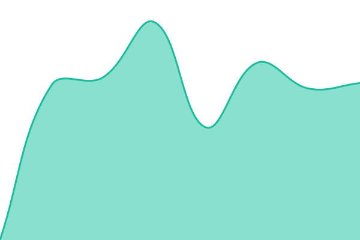

# [📈 Live Status](https://status.clearnique.com): <!--live status--> **🟩 All systems operational**

This repository contains the open-source uptime monitor and status page for [Grace Peter Mutiibwa](https://gracepeter.clearnique.com/), powered by [Upptime](https://github.com/upptime/upptime).

With [Upptime](https://upptime.js.org), you can get your own unlimited and free uptime monitor and status page, powered entirely by a GitHub repository. We use [Issues](https://github.com/GracePeterMutiibwa/clearnique-status-/issues) as incident reports, [Actions](https://github.com/GracePeterMutiibwa/clearnique-status-/actions) as uptime monitors, and [Pages](https://status.clearnique.com) for the status page.

<!--start: status pages-->
<!-- This summary is generated by Upptime (https://github.com/upptime/upptime) -->
<!-- Do not edit this manually, your changes will be overwritten -->
<!-- prettier-ignore -->
| URL | Status | History | Response Time | Uptime |
| --- | ------ | ------- | ------------- | ------ |
|  [Clearnique Chat](https://chat.clearnique.com) | 🟩 Up | [clearnique-chat.yml](https://github.com/GracePeterMutiibwa/clearnique-status-/commits/HEAD/history/clearnique-chat.yml) | 

 1078ms
     
 | 

<a href="https://status.clearnique.com/history/clearnique-chat">100.00%</a>
    

|  [Clearnique Home](https://clearnique.com) | 🟩 Up | [clearnique-home.yml](https://github.com/GracePeterMutiibwa/clearnique-status-/commits/HEAD/history/clearnique-home.yml) | 

 142ms
     
 | 

<a href="https://status.clearnique.com/history/clearnique-home">100.00%</a>
    

|  [Cingest API](https://ingest.clearnique.com) | 🟩 Up | [cingest-api.yml](https://github.com/GracePeterMutiibwa/clearnique-status-/commits/HEAD/history/cingest-api.yml) | 

 128ms
     
 | 

<a href="https://status.clearnique.com/history/cingest-api">100.00%</a>
    

<!--end: status pages-->

[**Visit our status website →**](https://status.clearnique.com)

## 📄 License

- Powered by: [Upptime](https://github.com/upptime/upptime)
- Code: [MIT](./LICENSE) © [Anand Chowdhary](https://anandchowdhary.com)
- Data in the `./history` directory: [Open Database License](https://opendatacommons.org/licenses/odbl/1-0/)
